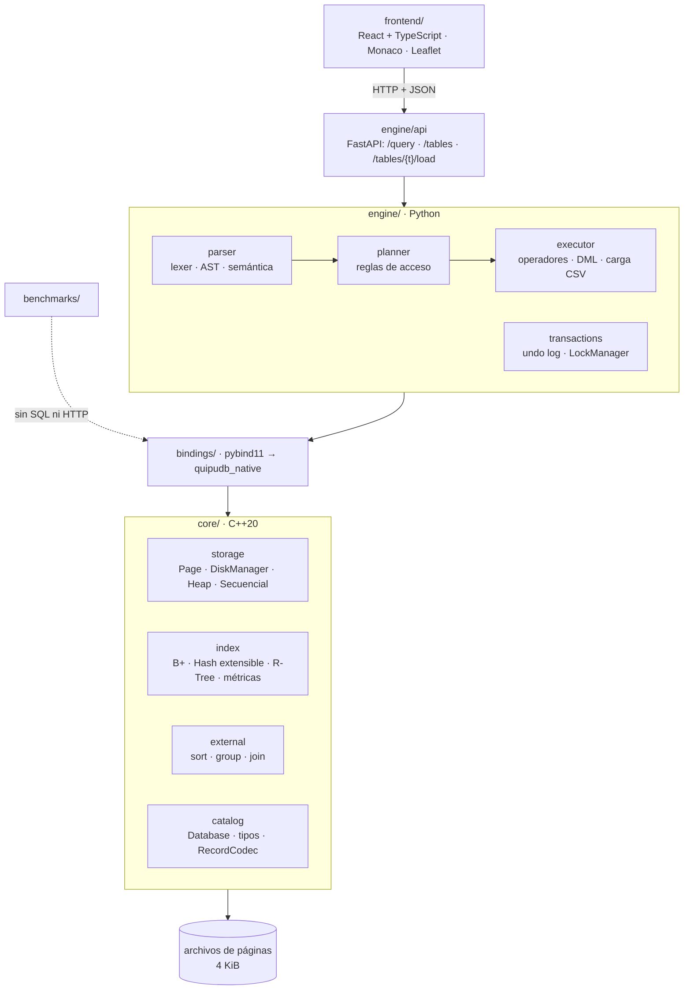

# QuipuDB

Motor de base de datos multimodal escrito desde cero: almacenamiento paginado,
índices B+ y hash, R-Tree para datos espaciales, búsqueda de texto y búsqueda
vectorial sobre imágenes y audio.

El nombre viene del **quipu**, el sistema andino de cuerdas anudadas que los
incas usaban para registrar y recuperar información: un motor de almacenamiento
e indexación anterior en siglos al disco duro.

> Proyecto Integrador del curso **Base de Datos 2**, Universidad de Ingeniería y
> Tecnología (UTEC), ciclo 2026-2. En desarrollo activo.

## Contenido

- [Estado del proyecto](#estado-del-proyecto)
- [Arquitectura del sistema](#arquitectura-del-sistema)
- [Arquetipo y organización del código](#arquetipo-y-organización-del-código)
- [Manual de instalación](#manual-de-instalación)
- [Uso](#uso)
- [Comparación experimental](#comparación-experimental)
- [Documentación](#documentación)
- [Equipo](#equipo)

## Estado del proyecto

| Parte | Contenido | Estado |
|---|---|---|
| 1 | Base de datos relacional: Heap y Secuencial, B+ agrupado y no agrupado, hash extensible, algoritmos externos, SQL, transacciones, interfaz y experimentos | **Completa** |
| 2 | Base de datos espacial: R-Tree, consultas por radio, k-NN y polígono, métricas euclidiana y Haversine, mapa, SQL espacial y comparación contra PostGIS | **Completa** |
| 3 | Búsqueda de texto: SPIMI, TF-IDF + coseno, BM25 | Pendiente |
| 4 | Búsqueda vectorial multimedia: SIFT/MFCC, IVF, HNSW | Pendiente |
| 5 | Aplicación de IA sobre la API del motor | Pendiente |

## Arquitectura del sistema

El motor está partido en dos capas con un contrato explícito entre ellas: un
**núcleo en C++20**, que es lo único que toca disco, y una **capa Python** que
traduce SQL a operaciones del núcleo y la expone por HTTP. La interfaz web solo
habla con la API.



| Capa | Responsabilidad |
|---|---|
| `core/storage` | Páginas de 4 KiB con cabecera de 8 bytes; `DiskManager` lee, escribe y asigna páginas (la 0 guarda metadatos). Heap File con lista libre LIFO y reutilización de slots; Archivo Secuencial con overflow por grupo, borrado lazy y reorganización al superar 30 % de desperdicio. |
| `core/index` | Árbol B+ persistente (tabla agrupada y índice no agrupado), hash extensible con FNV-1a, R-Tree con split cuadrático, métricas euclidiana y Haversine, y la búsqueda espacial secuencial usada como línea base. |
| `core/external` | Ordenamiento externo con mezcla k-way, agrupación externa por hash con caída a sort, hash join externo e index nested loop. |
| `core/catalog` | Tipos (`INT`, `DOUBLE`, `BOOL`, `DATE`, `VARCHAR(n)`, `POINT`), codificación de registros de ancho fijo, catálogo y apertura de tablas e índices. |
| `bindings/` | Módulo `quipudb_native`: expone el núcleo a Python con las mismas excepciones. |
| `engine/parser` | Lexer con posiciones, parser descendente recursivo, AST inmutable y validación semántica. |
| `engine/planner` | Elige el acceso por reglas (clave primaria, índice secundario, R-Tree o recorrido) y construye el plan de ejecución. |
| `engine/executor` | Ejecuta el plan, mantiene los índices en `INSERT`/`DELETE`, carga CSV y mide cada operador. |
| `engine/transactions` | `BEGIN`/`END TRANSACTION`, bitácora de deshacer en memoria y locks de tabla compartidos/exclusivos con timeout. |
| `engine/api` | API REST con FastAPI: un único `QueryProcessor` por proceso, con acceso serializado. |
| `frontend/` | Paneles de Archivos, Consultas, Resultados, Mapa y Plan de ejecución. |

**Contratos.** `TableFile` es una organización de registros (Heap, Secuencial, B+
agrupado); `Index` asocia una clave con un RID (página, slot) y lo implementan el
B+ no agrupado, el hash extensible y el R-Tree. Los índices secundarios solo se
montan sobre Heap, que es la única organización donde un RID no cambia al
insertar o reorganizar.

**Plan de ejecución.** Cada `SELECT` devuelve, junto con sus filas, un árbol de
pasos (`scan`, `index_search`, `index_range`, `radius_search`, `knn_search`,
`polygon_search`, `fetch`, `filter`, `sort`, `group`, `join`, `limit`, `project`) con las páginas
leídas, los registros examinados y devueltos y el tiempo de cada uno. El mismo
contrato ([ADR 0002](docs/adr/0002-plan-de-ejecucion.md)) alimenta el panel de
plan de la interfaz y los benchmarks.

**Recorrido de una consulta.** La interfaz envía el SQL a `POST /query`; el
lexer y el parser construyen el AST de todo el lote antes de ejecutar nada; la
validación semántica resuelve tablas, columnas y tipos; el planner elige el
acceso; el executor adquiere los locks, llama al núcleo por los bindings y
devuelve filas y plan.

El detalle está en [`docs/arquitectura.md`](docs/arquitectura.md), y las
decisiones de diseño fechadas en [`docs/adr/`](docs/adr/).

## Arquetipo y organización del código

El repositorio es un **monorepo organizado por capas**: cada directorio de primer
nivel corresponde a una capa de la arquitectura, y las pruebas viven junto al
código que verifican (`core/tests/` replica la estructura de `core/src/`; en
Python, cada módulo tiene su `test_*.py` al lado).

```
quipudb/
├── CMakeLists.txt              build del núcleo, sus pruebas y los bindings (opcionales)
├── requirements.txt            dependencias de la capa Python
├── core/                       C++20: lo único que toca disco
│   ├── include/quipudb/        cabeceras públicas; cada una documenta su contrato
│   │   ├── storage/            page, disk_manager, heap_file, sequential_file
│   │   ├── index/              bplus_tree, bplus_clustered_table, bplus_unclustered_index,
│   │   │                       extendible_hash(_index), rtree(_index), distance, spatial_scan
│   │   ├── external/           external_sort, external_group, external_join
│   │   └── catalog/            types, record_codec, table, catalog, database
│   ├── src/                    implementaciones, con la misma estructura
│   └── tests/                  pruebas unitarias (GoogleTest + ctest)
├── bindings/module.cpp         pybind11 → módulo quipudb_native
├── engine/                     capa Python
│   ├── parser/                 tokens, lexer, parser, ast, semantic, bound_ast, errors
│   ├── planner/                optimizer, plan, explain, native_catalog
│   ├── executor/               processor, operators, predicates, dml, external,
│   │                           spatial, bulk_load, result, instrumentation
│   ├── transactions/           transaction, locks, demo_concurrencia
│   └── api/                    main (FastAPI), schemas, service
├── frontend/                   React 19 + TypeScript + Vite
│   └── src/
│       ├── panels/             FilesPanel, QueryPanel, ResultsPanel, MapPanel, PlanPanel
│       ├── api/                cliente HTTP y simulador en memoria (mock/)
│       ├── components/ hooks/ lib/
├── benchmarks/                 comparación experimental
│   ├── scripts/                generadores de datasets, suites, PostGIS y gráficas
│   ├── datasets/ results/      CSV generados (no se versionan)
│   └── *.md                    protocolos e informes de cada corrida
└── docs/
    ├── arquitectura.md         diseño general
    ├── adr/                    decisiones de arquitectura (ADR 0001–0005)
    └── informe/                informe modular y gráficas oficiales
```

Convenciones:

- **Nombres en español** en el dominio (`insertar`, `ubicacion`, `reorganizar`) y
  en inglés en las interfaces del núcleo (`insert`, `search`, `TableFile`).
- **Cada error del núcleo tiene su excepción** (`IoError`, `SchemaError`,
  `InvalidRecord`, `DuplicateKey`, `Unsupported`), que llega a Python con el mismo
  nombre, derivada de `QuipuDBError`.
- **Commits convencionales** (`feat(index): ...`, `test(bench): ...`), ramas por
  funcionalidad y pull requests revisados; un hook y la CI validan el formato.
  Ver [`CONTRIBUTING.md`](CONTRIBUTING.md).
- **CI** (GitHub Actions): compila el núcleo y corre `ctest`, ejecuta `ruff` y
  `pytest`, compila los bindings y prueba la integración SQL y espacial.

## Manual de instalación

### Requisitos

| Herramienta | Versión | Para qué |
|---|---|---|
| CMake | 3.20 o superior | Configurar el build del núcleo |
| Compilador C++ | Con soporte de C++20 (por ejemplo, GCC 13 o superior) | Núcleo y bindings |
| Python | 3.11 o superior | Capa Python, API y benchmarks |
| Node.js | 20 o superior | Interfaz web |
| Git | — | Clonar; GoogleTest y pybind11 se descargan solos con `FetchContent` |
| Docker | Opcional | Solo para la comparación contra PostGIS |

Probado en Ubuntu (CI), macOS sobre Apple Silicon y Windows 11 con MSYS2 UCRT64
(g++ 14 y el Python 3.11 de MSYS2).

### 1. Clonar

```bash
git clone https://github.com/oswaldoaqm/quipudb.git
cd quipudb
git config core.hooksPath .githooks     # valida los mensajes de commit
```

### 2. Compilar el núcleo y correr sus pruebas

```bash
cmake -S . -B build -DCMAKE_BUILD_TYPE=Release
cmake --build build --parallel
ctest --test-dir build --output-on-failure
```

### 3. Compilar los bindings de Python

Los necesitan el procesador SQL, las transacciones, la API y los benchmarks. Se
activan con `-DQUIPUDB_BUILD_PYTHON=ON`; pybind11 se descarga solo.

```bash
cmake -S . -B build-py -DCMAKE_BUILD_TYPE=Release -DQUIPUDB_BUILD_PYTHON=ON
cmake --build build-py --parallel
```

El módulo queda en `build-py/bindings/` y **debe compilarse para el mismo
intérprete de Python que lo va a importar** (misma versión y mismo toolchain:
en Windows, el Python de MSYS2 con el g++ de MSYS2).

### 4. Instalar la capa Python

```bash
python -m venv .venv
source .venv/bin/activate                 # Windows: .venv\Scripts\activate
pip install -r requirements.txt
```

Para que Python encuentre el engine y el módulo nativo:

```bash
export PYTHONPATH=$PWD/build-py/bindings:$PWD        # Linux/macOS
set PYTHONPATH=%CD%\build-py\bindings;%CD%            # Windows (cmd)
```

Si solo trabajas sobre la capa Python **no necesitas los bindings**: las pruebas
que dependen de ellos se saltan solas y `pytest` sigue pasando.

### 5. Verificar la instalación

```bash
python -c "import quipudb_native; print('bindings OK')"
python -m pytest -q                    # engine y benchmarks
ruff check engine benchmarks
```

### 6. Levantar la API

```bash
export QUIPUDB_CATALOG=datos/catalogo.txt    # opcional; este es el valor por defecto
uvicorn engine.api.main:app --reload --port 8000
```

La documentación interactiva queda en `http://localhost:8000/docs`. La API
acepta CORS desde el servidor de desarrollo del frontend (`localhost:5173`).

### 7. Levantar la interfaz

```bash
cd frontend
npm install
cp .env.example .env          # luego poner VITE_USE_MOCK=false para usar el motor real
npm run dev                   # http://localhost:5173
```

Con `VITE_USE_MOCK=true` (el valor de ejemplo) la interfaz usa un simulador en
memoria y no necesita la API ni el núcleo compilado. Con `VITE_USE_MOCK=false`
habla con la API en `VITE_API_URL` (por defecto `http://localhost:8000`).

| Script | Qué hace |
|---|---|
| `npm run dev` | Servidor de desarrollo con recarga en caliente |
| `npm run build` | Verifica tipos y compila a `frontend/dist/` |
| `npm run typecheck` | Solo la verificación de tipos |
| `npm run test:spatial` | Pruebas de la visualización espacial |

### Problemas frecuentes

- **`ModuleNotFoundError: quipudb_native`**: falta compilar los bindings o el
  `PYTHONPATH` no apunta a `build-py/bindings`.
- **`ImportError` al cargar el módulo**: se compiló para otro intérprete; vuelve
  a configurar `build-py` con el Python que vas a usar.
- **La interfaz dice "No se pudo contactar al motor"**: la API no está levantada
  o `VITE_API_URL` no coincide con su puerto.
- **`IoError ... declara N registros vivos y en las páginas hay M`**: el proceso
  terminó sin `flush` y el archivo quedó inconsistente; el motor no tiene
  recuperación ante caídas todavía. Borra el directorio de datos y vuelve a cargar.

## Uso

### Desde Python, con los bindings

Dan acceso al núcleo: `Database`, `TableFile`, `Index` y los tipos del esquema.

```python
import quipudb_native as q

db = q.Database("datos/catalogo.txt")
esquema = q.Schema("alumnos", [
    q.Column("codigo", q.DataType.INT),
    q.Column("nombre", q.DataType.VARCHAR, 32),
    q.Column("promedio", q.DataType.DOUBLE),
], key_column=0)

t = db.create_table(esquema, q.kind.HEAP)
t.insert([1, "ana", 15])            # el 15 se promueve a 15.0 segun el esquema

db.create_index("alumnos", "por_promedio", "promedio", q.kind.EXTENDIBLE_HASH)
ix = db.index("alumnos", "por_promedio")
for rid in ix.search(15.0):
    print(t.read(rid))

print(t.stats().as_dict())          # lo que consume el plan de ejecucion
db.flush()
```

Detalles que conviene saber:

- **`Database` es la puerta de entrada.** Devuelve siempre el mismo objeto para
  una tabla o índice dado; dos handles sobre el mismo archivo se pisan.
- **Los enteros se promueven según el esquema.** Un `15` en una columna DOUBLE
  entra como `15.0`, y en una DATE como `Date(15)`.
- **`bool` es `bool`.** No llega como entero, pese a que en Python `bool` derive
  de `int`.
- **`cursor()` no se expone**: deja de valer si la tabla se modifica, y desde
  Python eso sería un uso-después-de-liberar. `scan_with_rids()` devuelve copias
  materializadas para `DELETE`; `source_of()` lo envuelve sin entregarlo a los
  algoritmos externos.

### SQL

`QueryProcessor` ejecuta `CREATE TABLE`, `CREATE INDEX`, `DROP TABLE`,
`INSERT INTO`, `SELECT`, `EXPLAIN [ANALYZE]`, `DELETE FROM` y
`BEGIN`/`END TRANSACTION`. El resultado de una consulta incluye las filas y el
plan físico:

```python
import quipudb_native as q

from engine.executor import QueryProcessor

db = q.Database("catalogo.txt")
processor = QueryProcessor(db)
processor.execute(
    "CREATE TABLE cursos (id INT PRIMARY KEY, nombre VARCHAR(40), nota DOUBLE) USING HEAP"
)
processor.execute("INSERT INTO cursos VALUES (1, 'Bases de Datos 2', 18)")

# Varias sentencias se envian juntas si estan separadas por punto y coma.
batch = processor.execute(
    """INSERT INTO cursos VALUES (2, 'Sistemas Operativos', 17);
    INSERT INTO cursos VALUES (3, 'Compiladores', 16);
    INSERT INTO cursos VALUES (4, 'Redes', 15);"""
)
print(batch.affected_rows)     # 3

# Los indices secundarios solo se crean sobre tablas HEAP.
processor.execute("CREATE INDEX cursos_por_nota ON cursos (nota) USING BPLUS")

result = processor.execute("SELECT nombre, nota FROM cursos WHERE nota >= 14")
print(result.columns)          # ('nombre', 'nota')
print(result.plan.to_dict())   # index_range/fetch/project y sus estadísticas

planned = processor.execute("EXPLAIN SELECT nombre FROM cursos WHERE nota >= 14")
measured = processor.execute(
    "EXPLAIN ANALYZE SELECT nombre FROM cursos WHERE nota >= 14"
)
print(planned.plan.to_dict())  # ruta elegida, sin leer filas: contadores en cero
print(measured.plan.to_dict()) # misma consulta ejecutada, con medidas reales

ordered = processor.execute("SELECT nombre, nota FROM cursos ORDER BY nota DESC")
top_two = processor.execute(
    "SELECT nombre, nota FROM cursos ORDER BY nota DESC LIMIT 2"
)
grouped = processor.execute(
    "SELECT nombre, COUNT(*), AVG(nota) FROM cursos GROUP BY nombre ORDER BY nombre"
)
print(ordered.rows)            # filas ordenadas mediante ExternalSort
print(top_two.rows)            # las dos primeras despues de ordenar
print(grouped.columns)         # ('nombre', 'COUNT_all', 'AVG_nota')

deleted = processor.execute("DELETE FROM cursos WHERE nota < 11")
print(deleted.affected_rows)   # 0

processor.execute("DROP TABLE cursos")
```

`WHERE` admite `=`, `<`, `<=`, `>`, `>=` y `BETWEEN` inclusivo. El planner usa
la clave primaria o un índice secundario aplicable; si no existe uno, registra
el `scan` y el filtro en memoria. `DELETE` materializa todos sus candidatos antes
de escribir y mantiene cada índice secundario. `ORDER BY` admite `ASC` y `DESC`
y usa external sorting; `GROUP BY` admite `COUNT(*)`, `SUM`, `MIN`, `MAX` y
`AVG`, y usa external hashing con fallback seguro a sort. El plan explica la
dirección, los runs, las pasadas, la estrategia y las particiones realmente
utilizadas. `LIMIT n` acepta un entero no negativo y se aplica al final.

`CREATE INDEX nombre ON tabla (columna) USING BPLUS` crea un B+ secundario no
agrupado; `USING HASH` crea un hash extensible y `USING RTREE` un índice
espacial sobre una columna `POINT`. También se aceptan los nombres explícitos
`BPLUS_UNCLUSTERED` y `EXTENDIBLE_HASH`. El índice se construye sobre las filas
existentes y queda disponible para el optimizador. `EXPLAIN` genera el plan sin
recorrer filas; `EXPLAIN ANALYZE` ejecuta el `SELECT` para obtener estadísticas
reales. Ambos devuelven el plan y no las filas de la consulta explicada.

Las sentencias pueden ocupar varias líneas y contener comentarios `-- ...` o
`/* ... */`. Un lote separado por `;` se analiza completo antes de ejecutar; se
suman sus `affected_rows` y las filas y el plan pertenecen a la última sentencia.
Las sentencias se confirman individualmente por defecto; para que un lote sea
atómico ante un error de ejecución se encierra entre `BEGIN TRANSACTION;` y
`END TRANSACTION;`.

Para pruebas reproducibles puede limitarse la memoria de los algoritmos externos:

```python
processor = QueryProcessor(
    db,
    external_buffers=3,
    external_page_size=512,
    temp_dir="temporales",
)
```

### SQL espacial

El tipo `POINT` recibe coordenadas en orden latitud, longitud, y ambos límites
se validan antes de escribir en disco:

```python
processor.execute(
    "CREATE TABLE lugares (id INT PRIMARY KEY, nombre VARCHAR(40), ubicacion POINT)"
)
processor.execute("INSERT INTO lugares VALUES (1, 'UTEC', POINT(-12.1354, -77.0227))")
processor.execute(
    "CREATE INDEX lugares_ubicacion ON lugares (ubicacion) USING RTREE"
)
cercanos = processor.execute(
    "SELECT nombre FROM lugares "
    "WHERE DISTANCIA(ubicacion, POINT(-12.1354, -77.0227)) < 5000"
)
print(cercanos.rows)            # (('UTEC',),)
print(cercanos.plan.to_dict())  # radius_search/rtree -> fetch -> filter

vecinos = processor.execute(
    "SELECT * FROM lugares "
    "ORDER BY DISTANCIA(ubicacion, POINT(-12.1354, -77.0227)) LIMIT 10"
)
print(vecinos.rows)            # hasta 10 registros, de más cerca a más lejos
print(vecinos.plan.to_dict())  # knn_search/rtree -> fetch; sin sort
```

`POINT` ocupa 16 bytes (dos `double`) y viaja por la API como
`{"latitude": ..., "longitude": ...}`. `DISTANCIA` usa `HAVERSINE` por defecto,
cuyo radio está en metros; `DISTANCIA(ubicacion, POINT(...), EUCLIDEAN)` usa
distancia plana en las unidades de las coordenadas. Sin R-Tree, la misma
consulta se resuelve con `scan` y filtro en memoria.

`ORDER BY DISTANCIA(columna, POINT(...)[, metrica])` ordena por cercanía. Sobre
una tabla con R-Tree, `ASC LIMIT k` usa el k-NN del índice y recupera solo esos
vecinos, sin ordenar toda la tabla. Sin índice, sin `LIMIT`, con `DESC`, con
`WHERE` o sobre un JOIN, se calcula la distancia y se ordena con ExternalSort
antes del corte final. Un centro como `mi_ubicacion` en el enunciado representa
el literal `POINT(latitud, longitud)`; no es una variable SQL. Los empates por
distancia pueden devolver cualquiera de las filas empatadas.

`DENTRO(columna, POLYGON(POINT(...), POINT(...), POINT(...)[, ...]))` devuelve
los puntos dentro de un polígono, por ejemplo las sucursales de un distrito:

```sql
SELECT * FROM tiendas
WHERE DENTRO(ubicacion, POLYGON(POINT(-12.02, -77.06), POINT(-12.02, -77.00),
  POINT(-12.08, -77.00), POINT(-12.08, -77.03), POINT(-12.05, -77.03),
  POINT(-12.05, -77.06)));
```

Los vértices van en orden (horario o antihorario) y sin repetir el primero al
final; hacen falta al menos tres distintos. El polígono puede ser no convexo y
**el borde cuenta como dentro**. Con R-Tree el plan es `polygon_search/rtree ->
fetch`: el MBR del polígono poda subárboles y cada candidato se comprueba con el
número de cruces. Sin índice es `scan` + `filter`, con exactamente el mismo
criterio de borde. `DENTRO` también sirve en `DELETE` y se combina con
`ORDER BY` y `LIMIT`.

### API REST

| Ruta | Qué hace |
|---|---|
| `POST /query` | Ejecuta SQL (`{"sql": "..."}`) y devuelve columnas, tipos, filas, plan y, si hay una condición espacial, un `spatial_context` (`kind: "radius"` con centro y radio, o `kind: "polygon"` con los vértices) |
| `GET /tables` | Describe cada tabla: columnas, organización, índices y número de registros |
| `POST /tables/{tabla}/load` | Carga un CSV en una tabla existente |

#### Carga masiva desde CSV

El archivo va como `multipart/form-data` en el campo `file`:

```bash
curl -F "file=@alumnos.csv" http://localhost:8000/tables/alumnos/load
```

```json
{
  "table": "alumnos",
  "encoding": "utf-8",
  "inserted": 99998,
  "failed": 2,
  "errors": [
    {"line": 58, "error": "columna codigo: 'x12' no es un INT"},
    {"line": 904, "error": "no se pudo insertar: la clave primaria ya existe en alumnos"}
  ],
  "errors_truncated": false
}
```

- **La cabecera es obligatoria** y empareja las columnas por nombre, en
  cualquier orden y sin distinguir mayúsculas (salvo que la tabla tenga dos
  columnas que solo difieran en eso). Si falta, sobra o se repite alguna, se
  responde 400 diciendo cuáles y no se inserta nada. Las columnas sin nombre
  al final de la cabecera se ignoran, pero sus campos tienen que venir vacíos.
- **El separador se detecta en la cabecera**: coma, punto y coma o tabulador.
  Un CSV guardado desde Excel en español usa punto y coma y coma decimal; en
  ese caso un `DOUBLE` puede venir como `15,5`.
- **Los valores se convierten al tipo del esquema** con las mismas reglas que
  un `INSERT`: `INT` de 32 bits, `DOUBLE` finito, `BOOL` como `true`/`false` o
  `1`/`0`, `DATE` como `AAAA-MM-DD` y `VARCHAR(n)` de hasta `n` bytes en UTF-8.
  Un campo vacío solo es válido en un `VARCHAR`, porque el motor no tiene
  `NULL`.
- **Por defecto la carga es parcial**: cada fila se inserta por separado; las
  que no se pueden convertir o insertar se cuentan en `failed` y se detallan
  con la línea del archivo donde empiezan (contando la cabecera). Solo se
  listan las primeras 100; `errors_truncated` avisa si hubo más.
- **Con `?atomic=true`** la primera fila que falla deshace todas las anteriores
  y se responde 400 con su línea. Usa la misma bitácora de deshacer que
  `BEGIN TRANSACTION`, que guarda una entrada por fila cargada.
- **Codificación: UTF-8 (con o sin BOM) o cp1252**, que es lo que escribe
  "Guardar como CSV" en un Excel de Windows en español. `encoding` en la
  respuesta dice cuál se usó. Un archivo con tildes en UTF-8 y algún byte roto
  no se reinterpreta como cp1252: se rechaza entero antes de insertar,
  indicando la primera línea inválida.
- **No se lee entero en memoria**: FastAPI lo deja en un archivo temporal y se
  procesa fila por fila. 100 000 filas cargan en unos segundos.
- No se puede cargar con un `BEGIN TRANSACTION` abierto, y la tabla queda con
  un lock exclusivo mientras dura la carga.

Desde Python, sin pasar por HTTP:

```python
with open("alumnos.csv", encoding="utf-8-sig", newline="") as archivo:
    reporte = processor.load_csv("alumnos", archivo)
print(reporte.inserted, reporte.failed)
```

### Interfaz

Cinco paneles en una sola pantalla:

- **Archivos**: tablas con su organización, columnas, índices y botón para cargar CSV.
- **Consultas**: editor Monaco con resaltado SQL; `Ctrl+Enter` ejecuta y los errores
  se muestran con línea y columna.
- **Resultados**: tabla virtualizada con el tipo de cada columna, filas y tiempo.
- **Mapa**: Leaflet sobre OpenStreetMap. Resultados en azul, resto de la tabla en
  gris, punto de referencia en ámbar y la región de búsqueda: el círculo de un
  radio Haversine o el polígono de `DENTRO`. El detalle está en [`docs/frontend-mapa-radio.md`](docs/frontend-mapa-radio.md).
- **Plan de ejecución**: árbol de pasos con páginas y tiempo por operador,
  coloreados según sean en memoria, algoritmo externo o acceso por índice.

### Demostración de concurrencia

```bash
python -m engine.transactions.demo_concurrencia --modo sin-lock   # actualizaciones perdidas
python -m engine.transactions.demo_concurrencia --modo con-lock   # resultado correcto
```

Cuatro hilos incrementan cinco veces la misma fila con
`BEGIN → SELECT → DELETE → INSERT → END`. Sin un `LockManager` compartido el
contador termina por debajo de 20; con él, siempre en 20, y los interbloqueos de
upgrade compartido→exclusivo se resuelven por timeout y reintento.

## Comparación experimental

Los benchmarks llaman directamente a los bindings, sin SQL ni HTTP. Cada corrida
oficial guarda sus CSV con un ID y su SHA-256; las gráficas y tablas se generan
desde esos CSV.

| Experimento | Compara | Informe |
|---|---|---|
| #39 | Heap File vs. Archivo Secuencial (1k, 10k, 100k) | [`comparacion_heap_secuencial.md`](benchmarks/comparacion_heap_secuencial.md) |
| #40 | B+ agrupado vs. B+ no agrupado vs. hash extensible | [`comparacion_indices.md`](benchmarks/comparacion_indices.md) |
| #131 | R-Tree vs. búsqueda secuencial | [`comparacion_rtree_secuencial.md`](benchmarks/comparacion_rtree_secuencial.md) |
| #132 | Secuencial vs. R-Tree vs. GiST de PostGIS | [`docs/informe/comparacion_espacial.md`](docs/informe/comparacion_espacial.md) |

```bash
python benchmarks/scripts/generar_datasets.py       # alumnos 1k/10k/100k
python benchmarks/scripts/generar_puntos.py         # puntos 1k/10k/100k

PYTHONPATH=build-py/bindings python -B benchmarks/scripts/ejecutar_benchmarks.py \
  --suite archivos --tamanos 1000 10000 100000 --consultas 1000
PYTHONPATH=build-py/bindings python -B benchmarks/scripts/ejecutar_benchmarks.py \
  --suite indices --tamanos 1000 10000 100000 --consultas 1000 --consultas-rango 100
PYTHONPATH=build-py/bindings python -B benchmarks/scripts/ejecutar_benchmarks.py \
  --suite espacial --tamanos 1000 10000 100000 --calentamientos 1 --repeticiones 5

python -B benchmarks/scripts/generar_graficas.py
python -B benchmarks/scripts/generar_graficas_espacial.py
```

La medición contra PostGIS necesita Docker; los pasos están en el
[README de benchmarks](benchmarks/README.md#gist-de-postgis-issue-132), junto con
los protocolos completos de cada suite.

## Documentación

| Documento | Contenido |
|---|---|
| [`docs/arquitectura.md`](docs/arquitectura.md) | Diseño general del motor |
| [`docs/adr/`](docs/adr/) | Decisiones: núcleo (0001), plan de ejecución (0002), SQL (0003), transacciones (0004), locks (0005) |
| [`docs/informe/`](docs/informe/) | Informe modular: dominio, archivos e índices, SQL, transacciones, interfaz y experimentos |
| [`benchmarks/README.md`](benchmarks/README.md) | Datasets, protocolos y reproducción de las corridas |
| [`CONTRIBUTING.md`](CONTRIBUTING.md) | Ramas, commits y pull requests |

## Equipo

| Integrante | Parte 1 | Parte 2 |
|---|---|---|
| Oswaldo Alejandro Quispe Monzon | Gestión de archivos e indexación (2.1.1, 2.1.2) | Estructura del R-Tree; API REST y carga CSV |
| Sebastian Cangalaya Martinez | Procesamiento de consultas SQL (2.1.3) | SQL espacial (2.2.3); R-Tree en el catálogo y el planner |
| Juan David Velo Poma | Transacciones y concurrencia (2.1.4) | Comparación experimental espacial (2.2.4) |
| Danna Gala | Interfaz de usuario (2.1.5) | Métricas y consultas del R-Tree (2.2.1) |
| Mauricio Teran | Comparación experimental (2.1.6) | Visualización en mapa (2.2.2) |

## Contribuir

Las convenciones de commits, ramas y pull requests están en
[`CONTRIBUTING.md`](CONTRIBUTING.md). Léelo antes del primer commit: el
historial del repositorio es parte de la evaluación del curso.

## Licencia

MIT. Ver [`LICENSE`](LICENSE).
