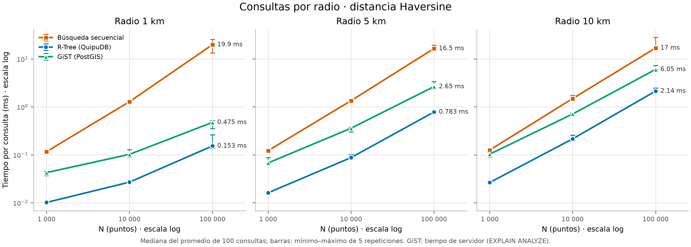
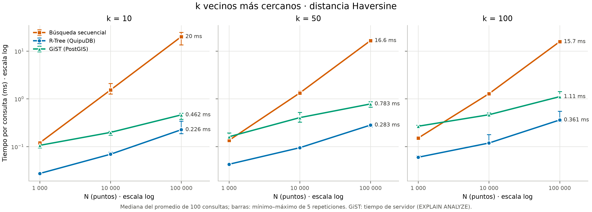
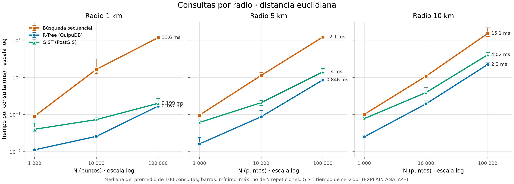
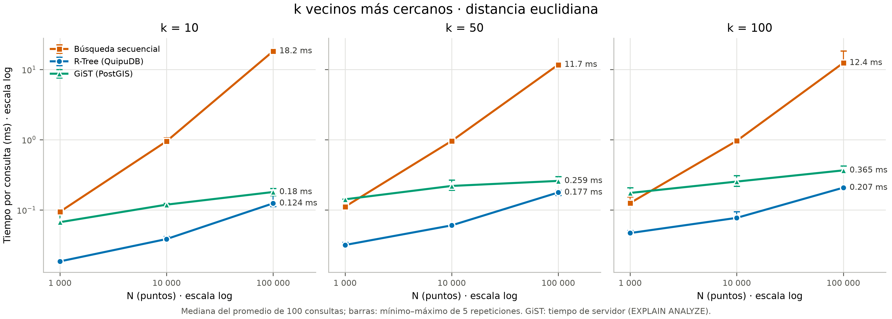
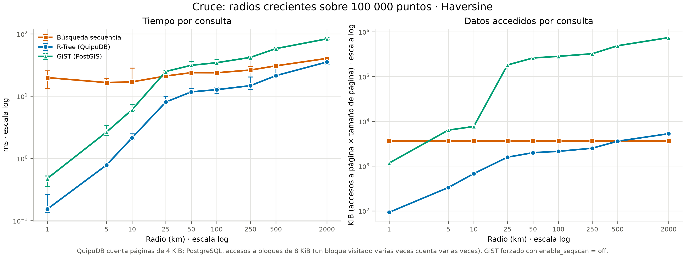
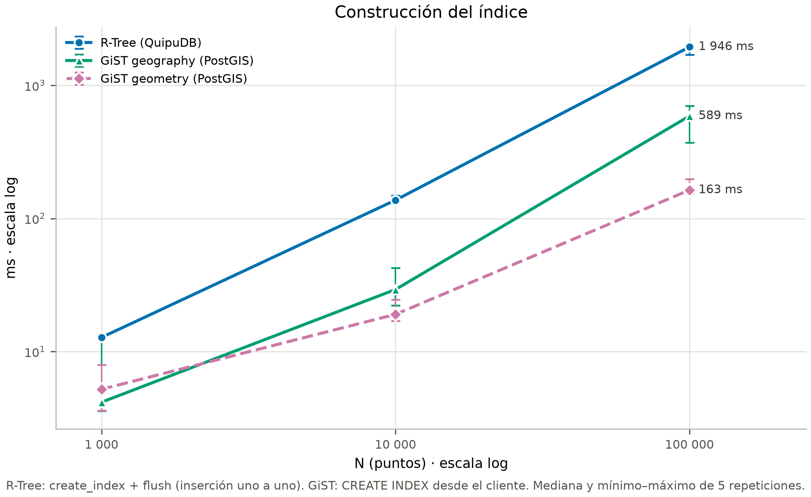
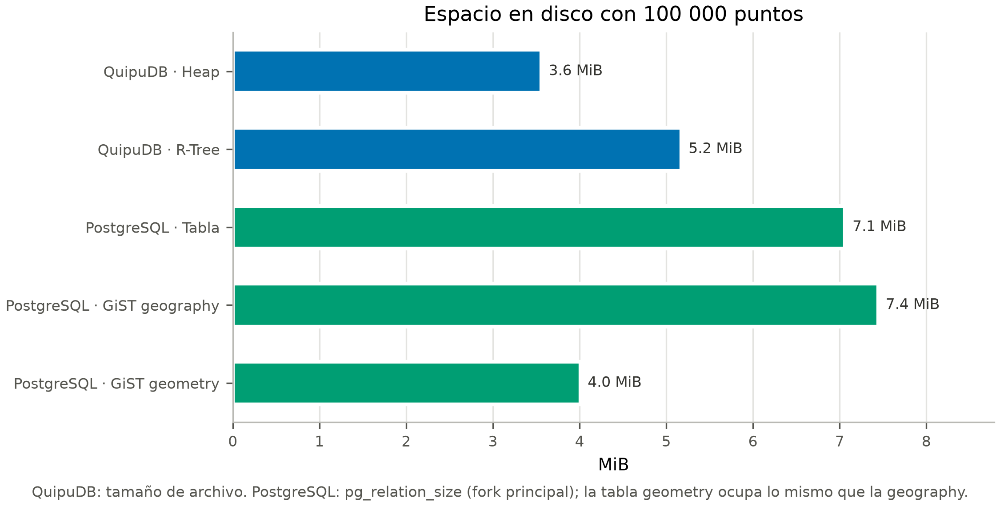

# Comparacion experimental espacial: secuencial vs R-Tree vs GiST (2.2.4)

Este documento cierra el 2.2.4 del enunciado: compara la **busqueda secuencial**,
el **R-Tree de QuipuDB** y el **GiST de PostgreSQL/PostGIS** con consultas por
radio (1, 5 y 10 km), k-NN (k = 10, 50 y 100) y datasets de 1 000, 10 000 y
100 000 puntos, midiendo construccion del indice, tiempo de consulta (promedio
de 100) y espacio en disco. Integra dos corridas:

- **#131**: secuencial y R-Tree, con detalle en
  [comparacion_rtree_secuencial.md](../../benchmarks/comparacion_rtree_secuencial.md).
- **#132**: GiST con PostGIS, mismas consultas sobre los mismos datos.

## Fuentes y reproduccion

| Corrida | ID | Mediciones |
|---|---|---|
| QuipuDB (#131) | `20261003T063020Z_ad4d7cbd6da347c3847d749ba6c6931a` | 555 |
| PostGIS (#132) | `20261003T071040Z_7813dc3770f14e0fa0eb518f4c6d8504` | 300 |

Los seis CSV estan fuera de Git; [fuentes_espacial.json](fuentes_espacial.json)
fija sus nombres y SHA-256. Las figuras de `graficas/espacial/` y las tablas de
la seccion Resultados las genera, sin ejecutar benchmarks:

```bash
MPLCONFIGDIR=/tmp/quipudb-matplotlib python -B benchmarks/scripts/generar_graficas_espacial.py
```

Como volver a medir esta en el
[README de benchmarks](../../benchmarks/README.md#gist-de-postgis-issue-132).

## Que se comparo, y que no es simetrico

Las tres tecnicas recibieron los mismos 1k/10k/100k puntos de #130 en el mismo
orden, los mismos 100 centros, los mismos radios y k, y las dos metricas. Con
Haversine, PostGIS usa `geography` con `use_spheroid = false`, la misma esfera
que el core; con la euclidiana, `geometry` en grados. **PostGIS devolvio
exactamente la misma cantidad de puntos que QuipuDB en los 54 casos de radio**:
el script aborta si no coinciden.

La comparacion es justa en datos y consultas, pero no en todo lo demas, y
conviene tenerlo presente al leer los numeros:

| Aspecto | QuipuDB | PostgreSQL / PostGIS |
|---|---|---|
| Que devuelve | RIDs; no toca la tabla | `id` de cada fila: visita el Heap |
| Que guarda la hoja del indice | El punto exacto | Una caja (GiST guarda MBR) |
| Chequeo exacto | Con el punto de la hoja | Releyendo la fila del Heap |
| Visibilidad | No hay MVCC | Comprueba cada tupla (MVCC) |
| Tiempo medido | Cliente Python, incluye el binding | Servidor (`EXPLAIN ANALYZE`, `TIMING OFF`), sin red ni planner |
| Pagina | 4 KiB, contador de paginas leidas | 8 KiB, accesos a buffer (los repetidos cuentan) |
| Entorno | Proceso fijado a un nucleo P | Contenedor en la VM de WSL2, sin fijar |
| Indices | Un R-Tree sirve a las dos metricas | Uno por tipo: `geography` y `geometry` |

Visto desde el cliente, cada consulta a PostgreSQL en Docker cuesta ~1,5-2 ms
mas por el viaje de ida y vuelta (queda registrado como
`tiempo_cliente_ns_mediana`): mas que la consulta misma. Por eso el tiempo
principal de GiST es el del servidor. Para medir GiST se forzo el indice
(`enable_seqscan = off`); lo que el planner habria elegido queda como "plan
natural".

## Graficas















Cada figura tiene su SVG al lado. Medianas de 5 repeticiones con barras
minimo-maximo; ejes logaritmicos en tiempo y N.

## Resultados

"R-Tree / GiST" menor que 1 significa que el R-Tree fue mas rapido. KiB por
consulta = paginas o accesos a bloque x tamano de pagina.

<!-- BEGIN RESULTADOS -->
<!-- generado por generar_graficas_espacial.py; N = 100 000 salvo indicacion -->

### Tiempo y datos accedidos por consulta (N = 100 000)

| Consulta | Métrica | Secuencial ms | R-Tree ms | GiST ms | R-Tree / GiST | KiB secuencial | KiB R-Tree | KiB GiST |
|---|---|---:|---:|---:|---:|---:|---:|---:|
| radio_1km | haversine | 19,9 | 0,153 | 0,475 | 0,322 | 3 640 | 93 | 1 167 |
| radio_5km | haversine | 16,5 | 0,783 | 2,651 | 0,295 | 3 640 | 332 | 6 358 |
| radio_10km | haversine | 17,0 | 2,140 | 6,053 | 0,354 | 3 640 | 679 | 7 672 |
| knn_10 | haversine | 20,0 | 0,226 | 0,462 | 0,489 | 3 640 | 57 | 236 |
| knn_50 | haversine | 16,6 | 0,283 | 0,783 | 0,361 | 3 640 | 79 | 639 |
| knn_100 | haversine | 15,7 | 0,361 | 1,112 | 0,325 | 3 640 | 95 | 1 101 |
| radio_1km | euclidiana | 11,6 | 0,167 | 0,199 | 0,840 | 3 640 | 93 | 883 |
| radio_5km | euclidiana | 12,1 | 0,846 | 1,396 | 0,606 | 3 640 | 330 | 5 596 |
| radio_10km | euclidiana | 15,1 | 2,205 | 4,024 | 0,548 | 3 640 | 674 | 6 671 |
| knn_10 | euclidiana | 18,2 | 0,124 | 0,180 | 0,690 | 3 640 | 57 | 135 |
| knn_50 | euclidiana | 11,7 | 0,177 | 0,259 | 0,685 | 3 640 | 79 | 462 |
| knn_100 | euclidiana | 12,4 | 0,207 | 0,365 | 0,567 | 3 640 | 95 | 867 |

### Cruce con radios crecientes (Haversine, N = 100 000)

| Radio | Devueltos por consulta | Secuencial ms | R-Tree ms | GiST ms | Plan natural de PostgreSQL |
|---:|---:|---:|---:|---:|---|
| 1 km | 90 | 19,9 | 0,153 | 0,475 | Bitmap Heap Scan > Bitmap Index Scan(puntos_geog_gist) |
| 5 km | 1 915 | 16,5 | 0,783 | 2,651 | Bitmap Heap Scan > Bitmap Index Scan(puntos_geog_gist) |
| 10 km | 6 059 | 17,0 | 2,140 | 6,053 | Bitmap Heap Scan > Bitmap Index Scan(puntos_geog_gist) |
| 25 km | 22 644 | 21,1 | 8,034 | 24,9 | Bitmap Heap Scan > Bitmap Index Scan(puntos_geog_gist) |
| 50 km | 35 429 | 23,8 | 11,7 | 31,3 | Bitmap Heap Scan > Bitmap Index Scan(puntos_geog_gist) |
| 100 km | 38 888 | 23,8 | 12,7 | 34,5 | Bitmap Heap Scan > Bitmap Index Scan(puntos_geog_gist) |
| 250 km | 45 126 | 26,3 | 14,7 | 41,9 | Bitmap Heap Scan > Bitmap Index Scan(puntos_geog_gist) |
| 500 km | 64 112 | 30,7 | 21,4 | 58,1 | Index Scan(puntos_geog_gist) |
| 2 000 km | 100 000 | 40,4 | 35,4 | 83,3 | Seq Scan |

### Construcción y espacio

| N | R-Tree ms | GiST geography ms | GiST geometry ms | Heap QuipuDB KiB | R-Tree KiB | Tabla PostgreSQL KiB | GiST geography KiB | GiST geometry KiB |
|---:|---:|---:|---:|---:|---:|---:|---:|---:|
| 1 000 | 12,8 | 4,156 | 5,199 | 44 | 64 | 72 | 96 | 56 |
| 10 000 | 137,3 | 29,2 | 19,0 | 368 | 536 | 696 | 784 | 424 |
| 100 000 | 1946,0 | 588,9 | 163,4 | 3 644 | 5 296 | 7 232 | 7 624 | 4 104 |
<!-- END RESULTADOS -->

## Lectura de los resultados

### 1. Los dos indices aplastan a la busqueda secuencial

A 100k, el secuencial tarda 12-20 ms por consulta haga lo que haga: siempre lee
las 910 paginas del Heap. R-Tree y GiST bajan a 0,1-6 ms en todas las consultas
del enunciado, y la distancia crece con N: el secuencial escala lineal y los
indices con lo que devuelven. Con 1k puntos, en cambio, el secuencial (~0,1 ms)
ya es igual o mas rapido que GiST en k-NN: con una tabla de 10 paginas, el costo
fijo de usar un indice no se recupera.

### 2. El R-Tree de QuipuDB fue mas rapido que GiST, y no es que sea mejor

En todas las consultas del enunciado el R-Tree tardo entre 0,30 y 0,84 veces lo
que tardo GiST. El issue esperaba lo contrario, y el resultado no significa que
el R-Tree sea un indice mejor: significa que **hace menos trabajo por consulta**.

- **No vuelve a la tabla.** La hoja del R-Tree guarda el punto exacto, asi que el
  filtro fino se hace en el indice y se devuelve el RID. GiST guarda cajas: para
  confirmar cada candidato PostgreSQL relee la fila en el Heap, y ademas tiene que
  devolver `id`. Se ve en los KiB: con 5 km, el R-Tree toca 332 KiB y GiST
  6 358 KiB, mas que leer entero el Heap de QuipuDB. Los puntos cercanos estan
  dispersos por toda la tabla (se insertaron en orden aleatorio), asi que el
  Bitmap Heap Scan termina visitando casi todas sus paginas.
- **No paga generalidad.** PostgreSQL comprueba visibilidad MVCC por tupla, y
  PostGIS deserializa cada `geography` y calcula sobre la esfera en coordenadas
  3D, un camino escrito para cualquier geometria. El R-Tree compara dos `double`.
- **La brecha se cierra donde PostGIS hace lo mismo.** Con la euclidiana,
  `geometry` es mas liviana y el cociente sube a 0,55-0,84; en el k-NN de 10, que
  casi no vuelve al Heap, a 0,69.

Si QuipuDB tuviera que devolver la fila completa (un `SELECT *` real) pagaria la
misma visita al Heap por RID, y la ventaja se reduciria; esta medicion no lo
cuantifica. Lo que PostgreSQL hace y QuipuDB no (concurrencia, WAL, MVCC, un
planner que elige solo) es justamente lo que cuesta ese factor de 2 a 3.

### 3. GiST construye mucho mas rapido; el R-Tree ocupa menos que `geography`

- **Construccion:** a 100k, GiST `geometry` tarda 163 ms y `geography` 589 ms,
  frente a 1 946 ms del R-Tree. PostgreSQL construye `geometry` con una carga
  ordenada que llena las paginas de una vez; el R-Tree inserta los puntos uno por
  uno, con un split cuadratico cada vez que se llena un nodo. Es la mejora mas
  clara para QuipuDB: una carga masiva STR o Hilbert.
- **Espacio:** el R-Tree ocupa 5,2 MiB; GiST `geography` 7,4 MiB y `geometry`
  4,0 MiB. La tabla de PostgreSQL (7,1 MiB) ocupa casi el doble que el Heap de
  QuipuDB (3,6 MiB): cada tupla lleva 23 bytes de cabecera MVCC, alineacion y un
  puntero de linea, y el punto va serializado con su SRID.

### 4. Donde deja de convenir cada indice

En la figura de cruce, a 100k con Haversine:

- El **R-Tree** sigue siendo mas rapido que el secuencial hasta 2 000 km (1,1x),
  aunque desde 500 km ya lee tantas paginas como el recorrido completo: sus hojas
  son livianas y las paginas estan en cache. Ver #131.
- **GiST forzado** pierde contra el secuencial de QuipuDB desde los 25 km (24,9
  frente a 21,1 ms), cuando la consulta devuelve ~23 % de la tabla: cada candidato
  es una visita al Heap.
- **El planner de PostgreSQL lo sabe.** Con radios chicos y medianos elige un
  Bitmap Index Scan; a 2 000 km, cuando la consulta abarca todo, elige **Seq
  Scan** por su cuenta. Es el mismo cruce que buscaba #131, decidido por costos.

### 5. Haversine frente a euclidiana

La Haversine cuesta mas en las tres tecnicas, pero en distinto grado: 1,1-1,7x en
el secuencial (una formula trigonometrica por punto), casi nada en los radios del
R-Tree (lo dominan las paginas), 1,6-1,8x en su k-NN (la cota a cada MBR sobre la
esfera es cara) y 1,5-3x en GiST (`geography` frente a `geometry`). Solo la
Haversine responde "a menos de 5 km" en metros; la euclidiana en grados sirve
para ordenar dentro de una zona chica.

## Tabla resumen: cuando usar cada tecnica

| | Busqueda secuencial | R-Tree (QuipuDB) | GiST (PostgreSQL/PostGIS) |
|---|---|---|---|
| **Ventajas** | Sin construccion ni espacio extra. Costo fijo y predecible. Sirve para cualquier predicado. | Consultas selectivas 8-150x mas rapidas que el secuencial a 100k. Hojas con el punto exacto: no vuelve a la tabla. Un solo indice para las dos metricas. Menos espacio que GiST `geography`. | Construccion 3-12x mas rapida (carga ordenada). Planner que decide solo entre indice y Seq Scan. Concurrencia, MVCC, WAL, recuperacion. Cualquier geometria y SRID, distancias sobre esfera o esferoide. |
| **Desventajas** | Lineal en N: 12-20 ms a 100k aunque devuelva 10 puntos. | Construccion lenta (insercion uno a uno, ~2 s a 100k). Solo puntos. Sin concurrencia ni recuperacion. Se usa aunque no convenga: no hay estimacion de costos. | 2-3x mas lento que el R-Tree en estas consultas por volver al Heap. Tabla e indice `geography` mas grandes. Un indice por tipo de dato. |
| **Usar cuando** | Tablas chicas (decenas de paginas), consultas que devuelven mas de la mitad de los puntos, o consultas esporadicas. | Puntos con pocas escrituras, consultas selectivas y k-NN, dentro de un motor propio. | Produccion: datos que cambian, varios usuarios, geometrias variadas, o cuando importa que el planner elija solo. |

## Limites

- Cache del sistema operativo y `shared_buffers` (128 MB) no controlados: todo
  cabe en memoria y las mediciones son de CPU y acceso a paginas en cache.
- Tiempos de PostgreSQL en el servidor, con la sobrecarga de `EXPLAIN ANALYZE`
  (cuenta filas por nodo); los de QuipuDB incluyen el binding de Python.
- La dispersion de PostGIS es mayor que la de QuipuDB: 27 % de mediana entre
  repeticiones ((max - min) / mediana), y hasta 230 % en la construccion con 1k,
  donde la mediana es de 4 ms. Docker corre en una VM que no se pudo fijar a un
  nucleo. Ninguna conclusion depende de diferencias de ese orden.
- Las paginas no son comparables 1 a 1: QuipuDB cuenta paginas de 4 KiB leidas,
  PostgreSQL accesos a bloques de 8 KiB, y un bloque visitado varias veces suma
  varias veces. Por eso las tablas usan KiB y se leen como orden de magnitud.
- Un solo equipo: Intel i5-1335U, 16 GB, NVMe; PostgreSQL 17.5 y PostGIS 3.5.2
  en Docker Desktop sobre WSL2, con `jit = off`.
