# Comparación experimental de estructuras de QuipuDB

Sección 2.1.6 · issue #41 · material para informe y exposición.

Este documento presenta **las corridas oficiales ya realizadas** de #39 y #40.
No contiene nuevos benchmarks ni mediciones de validación. Las figuras y tablas
numéricas se generan leyendo los CSV originales; las conclusiones describen ese
entorno y esas cargas, no una clasificación universal de estructuras.

## Fuentes y protocolo

| Experimento | ID oficial | Muestras | Resúmenes |
|---|---|---:|---:|
| #39: Heap–Secuencial | `20260918T025045Z_530093b2675c4ff8a483020858915b56` | 90 | 18 |
| #40: índices | `20260918T035512Z_4e75ba53c6a6497798a0d95a278f9dfe` | 315 | 63 |

Cada caso se ejecutó con N=1000, 10000 y 100000, un calentamiento y cinco
repeticiones medidas, con estado independiente. Los datasets compartieron hashes,
semilla 20260906 y orden mezclado. Las búsquedas de igualdad recuperaron registros
completos, no solo RIDs. Se conservan todas las muestras, incluso las altas.

Entorno documentado: Apple M2, 8 GiB de RAM, macOS 26.2 arm64, CPython 3.14.6,
bindings Release y páginas de 4096 bytes. El tamaño de página procede de las
corridas, no es una configuración impuesta por el generador. Los metadatos y hashes
completos permanecen en los CSV de entorno y en los informes originales:

- [Informe #39](../../benchmarks/comparacion_heap_secuencial.md).
- [Informe #40](../../benchmarks/comparacion_indices.md).
- [Manifiesto de las seis fuentes y sus SHA-256](fuentes_resultados.json).

Los CSV permanecen ignorados por Git en `benchmarks/results/`. Deben conservarse
aparte para regenerar este material. No se usan las tablas Markdown redondeadas
como entrada. Los detalles de generación están en el
[README de benchmarks](../../benchmarks/README.md#graficas-e-informe-issue-41).

## Cómo leer las figuras

- Tiempo en **milisegundos por lote u operación completa**, no latencia individual.
- Ambas escalas de las figuras de tiempo son logarítmicas y están rotuladas.
  Los segmentos conectan mediciones, no son ajustes ni predicciones.
- Líneas y marcadores: mediana. Barras: mínimo–máximo de cinco repeticiones,
  **no intervalos de confianza**. Puntos pequeños: las cinco muestras; pueden
  superponerse cuando son iguales o próximas. Ninguna muestra se elimina.
- Espacio: longitud real de archivos tras flush, en MiB (1048576 bytes), no RAM,
  bloques físicos del SSD ni pico temporal. Los paneles tienen ejes Y independientes,
  con origen cero; comparar alturas solo dentro de cada panel.
- Cada PNG tiene una versión SVG del mismo nombre en `graficas/`.

## #39: Heap File frente a Archivo Secuencial Paginado

### Inserción inicial

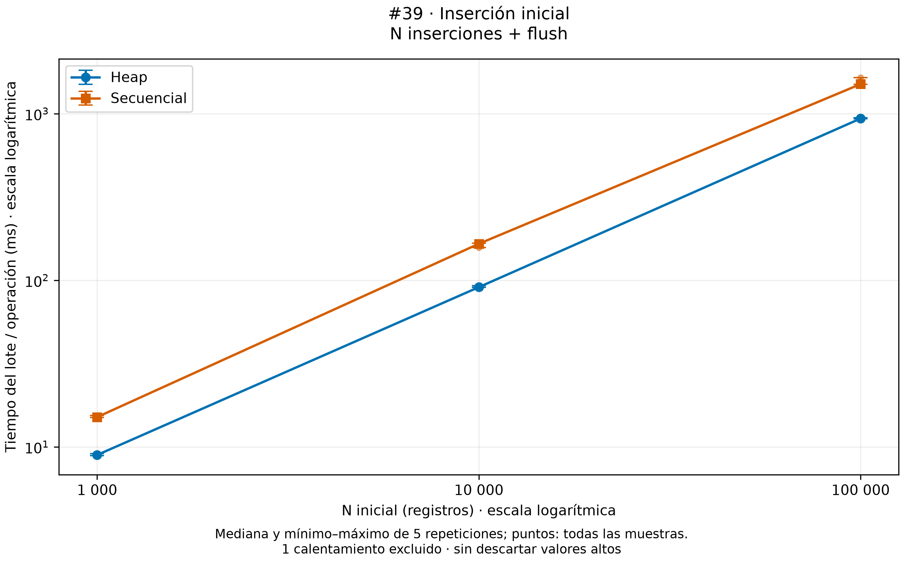

Se midieron N llamadas a insert y el flush final, en el mismo orden del CSV.
Heap tuvo menor mediana en los tres tamaños. Secuencial costó aproximadamente
1,69×, 1,82× y 1,61× el tiempo de Heap. La preparación y validación no se midieron.

### Búsqueda por clave primaria

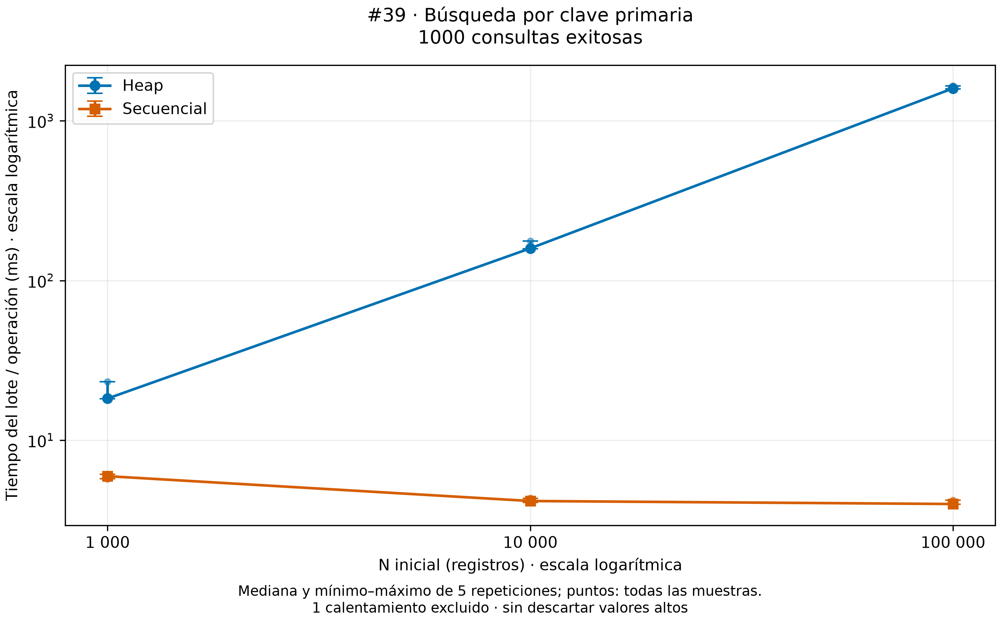

Ambos ejecutaron las mismas 1000 búsquedas exitosas por tamaño. Secuencial obtuvo
menor mediana en los tres tamaños; Heap creció de 18,24 a 1595,40 ms por lote.
La ligera reducción de Secuencial al aumentar N no demuestra que su complejidad
mejore: influyen selección, disposición y páginas visitadas. Dividir la mediana
del lote entre 1000 no produce una mediana de latencias individuales.

### Reorganización explícita

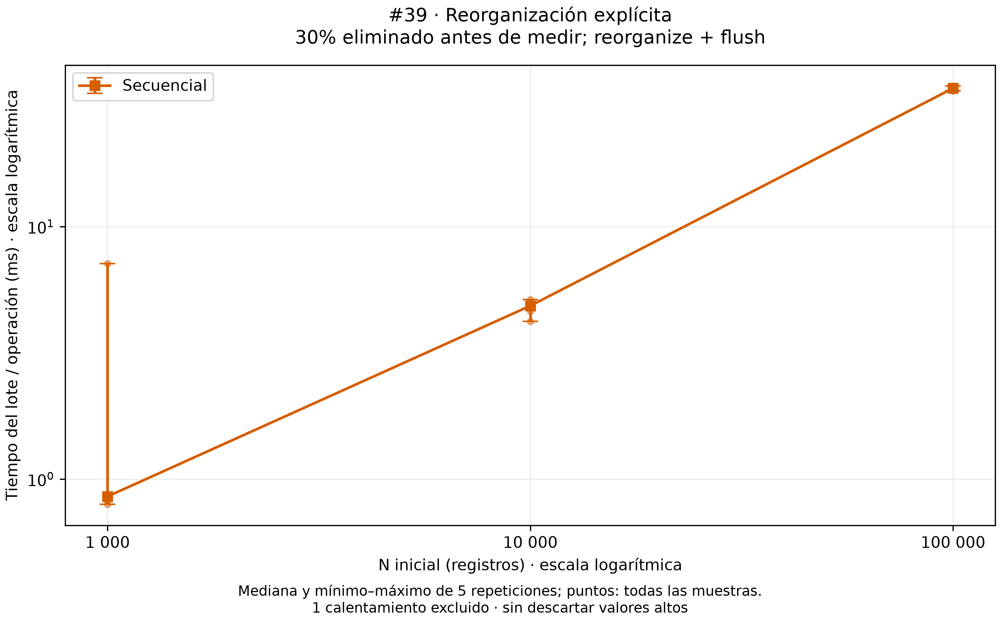

Con exactamente 30% eliminado durante la preparación, aún sin reorganización
automática, se midieron reorganize y flush. Las medianas fueron 0,853, 4,853 y
35,309 ms. En 1k se conserva una muestra alta de 7,118 ms, visible en la dispersión.
El estado final contiene 70% de N registros y desperdicio cero.

### Eliminación que dispara reorganización

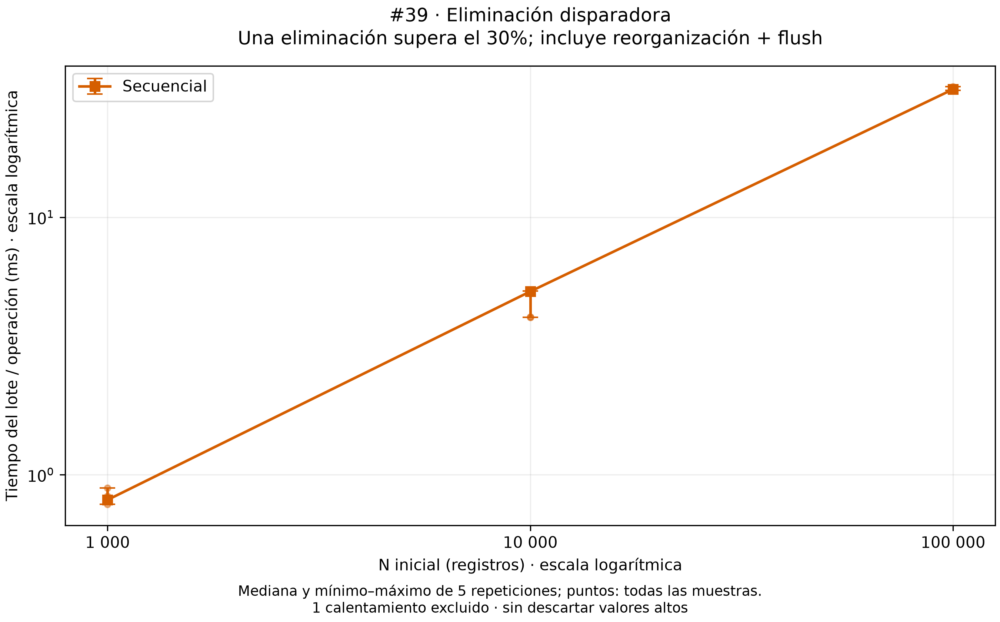

Sobre el 30% ya eliminado, se midió la siguiente eliminación y flush. Incluye
búsqueda, eliminación, metadatos y reorganización automática; **no es tiempo
aislado de reorganización**. Termina con un superviviente menos que el caso
explícito. Que resulte más rápido en algún tamaño no demuestra una ventaja causal
del mecanismo automático. No hay un caso equivalente inventado para Heap.

### Espacio después de cargar N registros

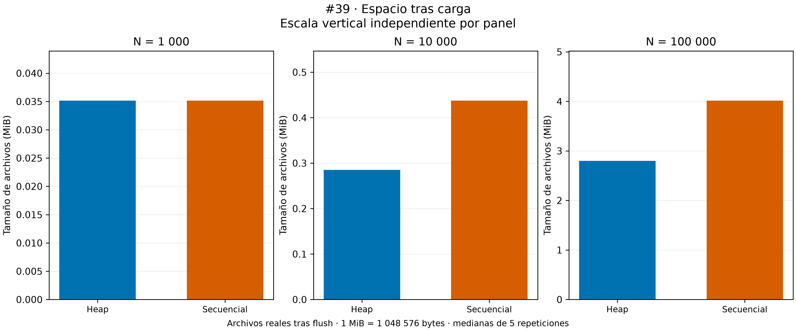

Empataron en 1k. Secuencial ocupó 53,42% más en 10k y 43,58% más en 100k.
Estos valores corresponden al estado cargado, no al archivo tras borrar/reorganizar.
Las páginas instrumentadas y el espacio de reorganización están en el informe #39.

## #40: B+ agrupado, B+ no agrupado y Extendible Hashing

### Carga indexada inicial

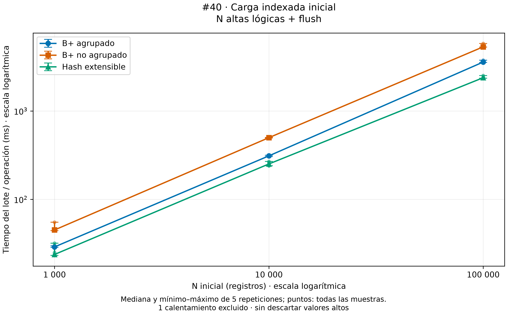

N altas lógicas y flush desde organizaciones vacías. Los secundarios incluyen
insertar en Heap y en el índice; agrupado inserta en su tabla-árbol. Hash obtuvo
la menor mediana en los tres tamaños, seguido de agrupado y no agrupado.

### Construcción sobre Heap existente

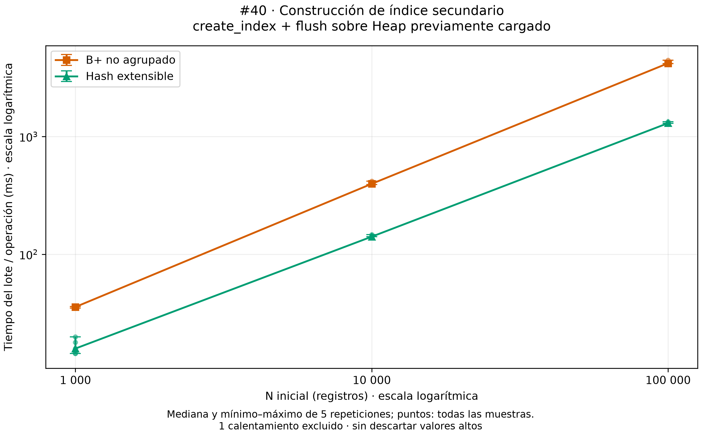

create_index completo y flush sobre Heap preparado. Incluye catálogo, archivo,
recorrido y construcción. Hash tuvo menor mediana que B+ secundario en los tres
tamaños. Agrupado no tiene un caso equivalente: su ausencia **no significa cero**.
No se resta esta figura de la carga inicial para inferir costes aislados.

### Igualdad con recuperación completa

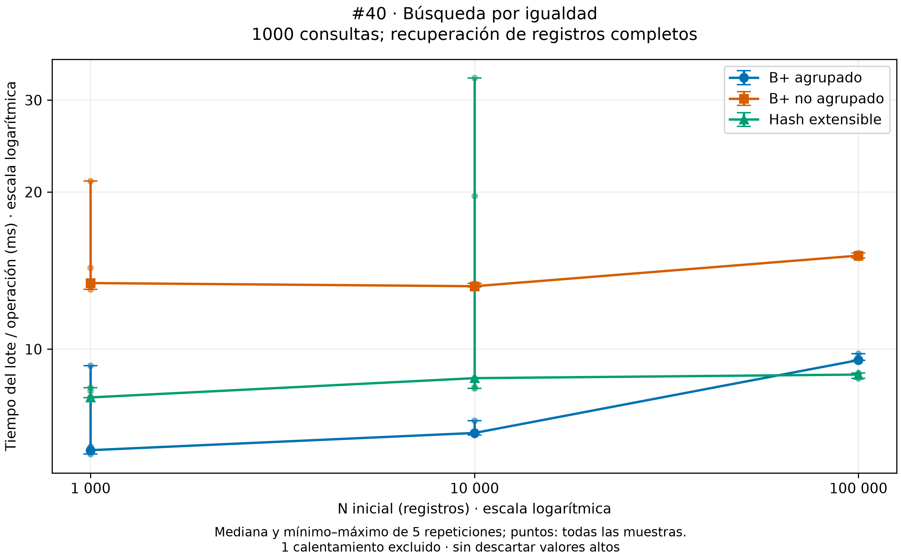

Agrupado fue más rápido en 1k y 10k. En 100k Hash tuvo una mediana ligeramente menor
(8,937 frente a 9,525 ms por 1000 consultas). No se afirma significancia estadística
ni una ventaja universal con cinco muestras. B+ secundario tuvo mayor mediana en
los tres tamaños; incluye resolver cada RID en Heap. Se conservan los picos de
Hash en 10k (incluido 33,066 ms) y B+ secundario en 1k.

### Rangos

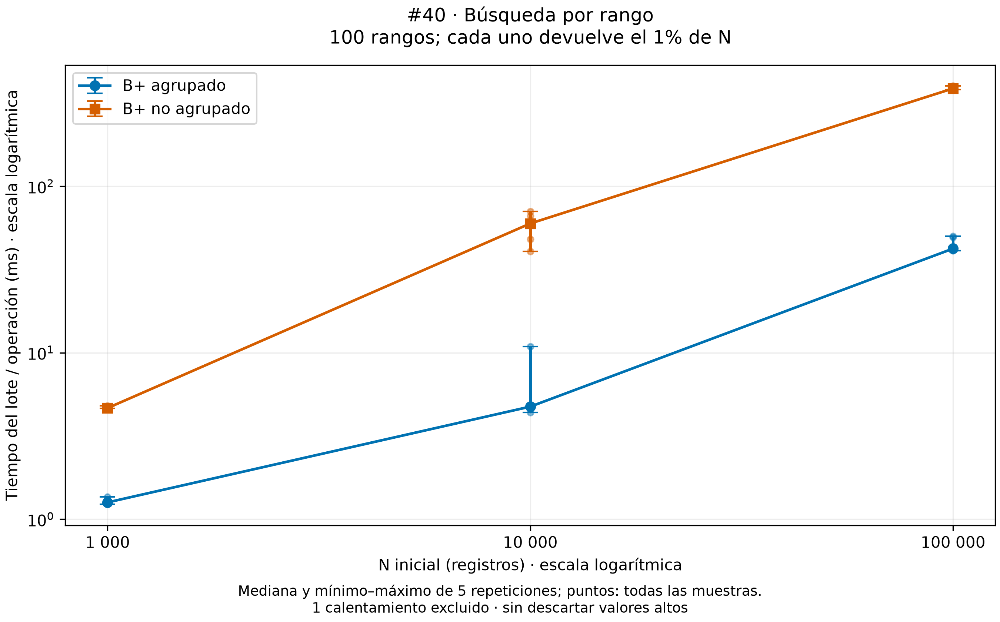

100 rangos por lote; cada rango devuelve el 1% de N, es decir, 10, 100 o 1000 filas.
Agrupado fue más rápido en los tres tamaños. El trabajo de salida aumenta con N,
por lo que la pendiente no mide exclusivamente el coste de localizar el rango.
Hash no ofrece rango nativo: no se emula ni se representa con tiempo cero.

### Recorrido ordenado

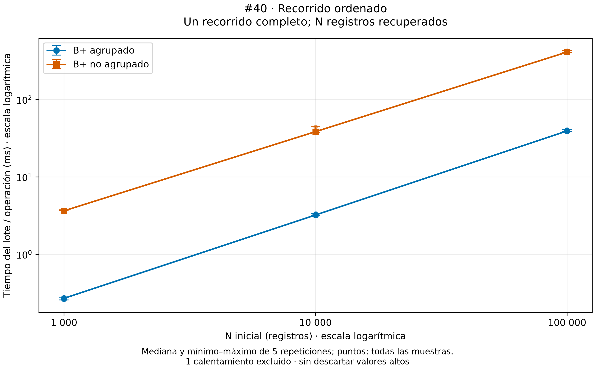

Una operación recupera N filas ordenadas por código. No es ordenar el CSV en RAM.
Agrupado tuvo menor mediana; en 100k, 39,324 frente a 411,402 ms. En ese tamaño,
las lecturas instrumentadas fueron 1119 frente a 100342: recuperar RIDs del Heap
es parte del trabajo del no agrupado. Hash no dispone de este recorrido nativo.

### Inserciones incrementales

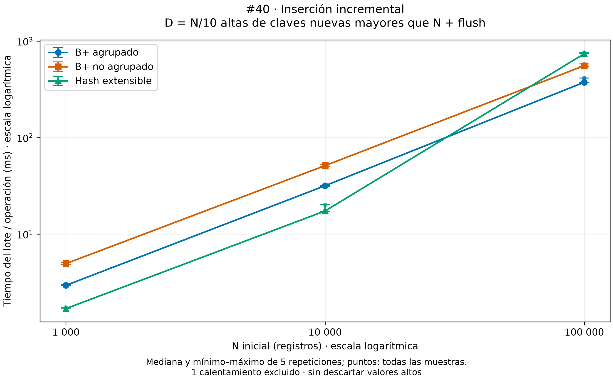

D=N/10 claves nuevas, mezcladas pero mayores que las iniciales; estado final N+D.
Hash fue más rápido en 1k/10k, pero más lento en 100k: 738,599 ms, frente a 374,334
de agrupado y 555,643 de no agrupado. Su archivo secundario pasó de 1056768 a
2105344 bytes y el lote registró 126170/125473 páginas leídas/escritas.
La expansión coincide con más tiempo y E/S instrumentada, pero no demuestra un
número de splits. No es un pico aislado: páginas y bytes fueron estables en las
cinco repeticiones. Esta carga no representa todas las distribuciones de claves.

### Eliminaciones incrementales

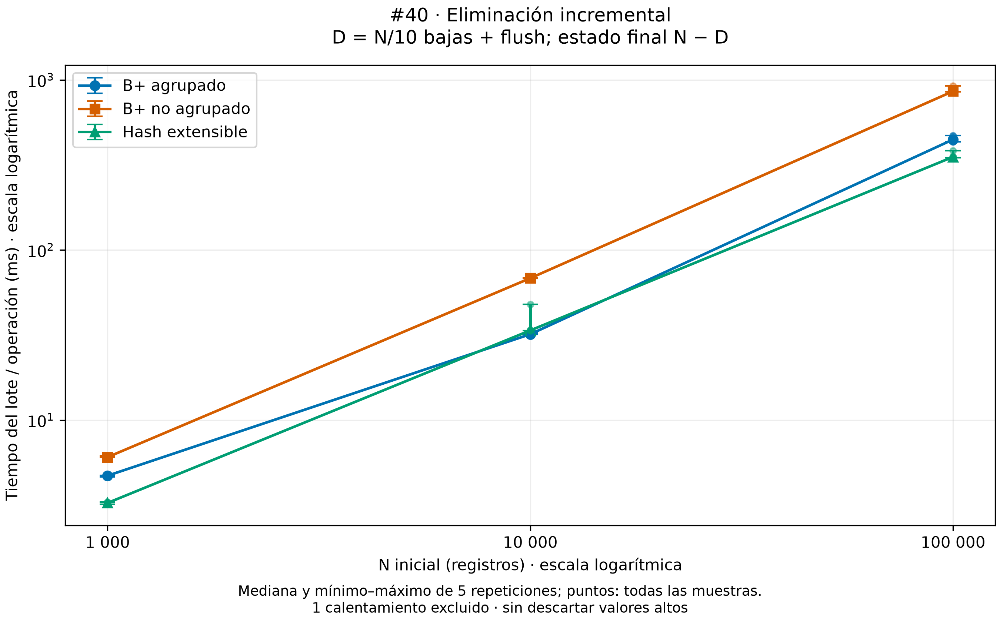

D=N/10 bajas y flush, final N−D. Hash tuvo menor mediana en 1k/100k; agrupado en
10k. Las bajas no redujeron la longitud de los archivos en estos casos. Eso no
demuestra ausencia de reutilización o merges internos.

### Mantenimiento mixto

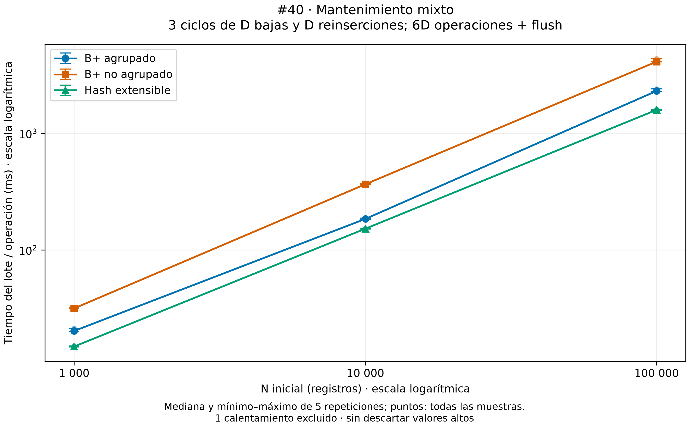

Tres ciclos de D bajas y D reinserciones de las mismas claves: 600, 6000 o 60000
operaciones lógicas, un flush final y N vivos al terminar. Hash tuvo menor mediana
en los tres tamaños. No equivale al experimento de crecimiento con claves nuevas.

### Espacio inicial y crecimiento

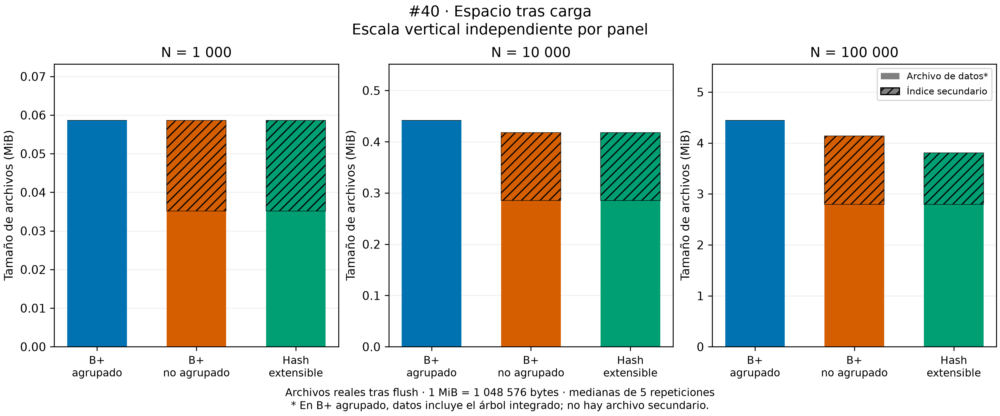

En agrupado, el archivo de datos **incluye el árbol completo**; cero bytes de índice
secundario no significa indexación gratuita. Los secundarios suman Heap e índice.
En 100k, Hash tuvo el menor total inicial: 3989504 bytes, frente a 4341760 del no
agrupado y 4657152 del agrupado. En 1k empataron las tres organizaciones.

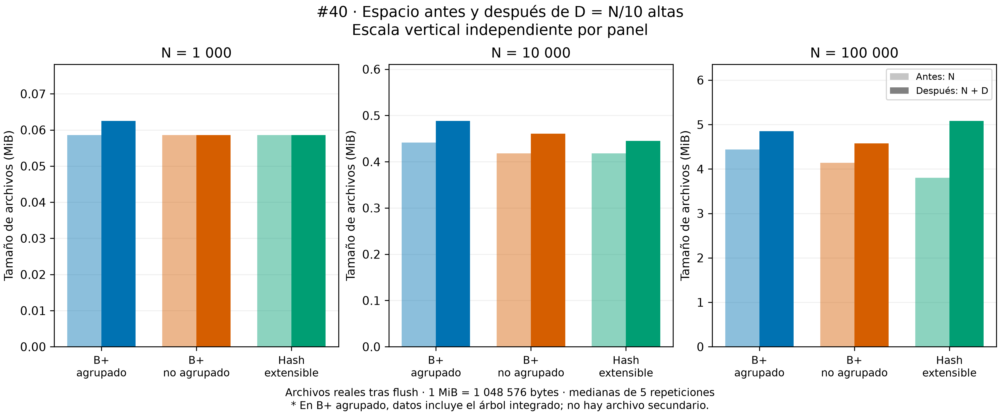

Tras D altas sobre 100k, Hash pasó a ocupar el mayor total: 5328896 bytes, frente
a 4800512 del no agrupado y 5083136 del agrupado. La decisión debe considerar el
estado inicial y el crecimiento; no comparar N contra N+D como estados equivalentes.

## Tabla de ventajas, desventajas y escenarios de uso

Ventajas de rendimiento limitadas a las corridas descritas; las capacidades ausentes
no se convierten en resultados numéricos. No se mezclan #39 y #40 en un ranking global.

| Técnica | Ventajas observadas / capacidad usada | Desventajas o costes observados | Cuándo considerarla |
|---|---|---|---|
| Heap | Inserción más rápida que Secuencial en los tres N; menor espacio en 10k/100k | Búsqueda PK más lenta y creciente en estos casos sin índice | Priorizar carga y espacio cuando esta búsqueda sin índice no domine |
| Secuencial paginado | Búsqueda PK más rápida que Heap en los tres N | Mayor coste de inserción; más espacio en 10k/100k; coste de reorganización | Priorizar consultas por clave y aceptar esos costes de actualización |
| B+ agrupado | Mejor tiempo que no agrupado en rangos y orden; mejor igualdad en 1k/10k | Organiza la tabla; mayor espacio inicial en 10k/100k que los secundarios; no ganó siempre en mantenimiento | Recuperar registros completos por rango u orden como prioridad |
| B+ no agrupado | Rango y orden manteniendo la organización Heap | Resolución de RIDs; tiempos de consulta mayores que agrupado en esta carga | Conservar Heap cuando se necesitan las capacidades de rango/orden del índice |
| Extendible Hashing | Menor tiempo de carga, construcción secundaria y mixto en los tres N | Sin rango/orden nativos; crecimiento de 100k encareció altas y espacio; no siempre ganó igualdad | Cargas y mantenimiento sin orden requerido, atendiendo al crecimiento y al tamaño |

## Conclusiones y límites

1. La elección depende de la operación y del estado de los datos, no de una sola
   cifra: Heap favoreció inserción frente a Secuencial; Secuencial favoreció PK.
2. Agrupado fue favorable para recuperar filas por rango y orden. El coste de
   resolver RIDs forma parte legítima del resultado de un índice secundario.
3. Hash fue favorable en carga, construcción secundaria y mantenimiento mixto,
   pero su crecimiento en 100k muestra por qué no debe juzgarse solo al cargar.
4. No se concluye que Hash gane siempre en igualdad, que borrar reduzca el archivo
   ni que agrupado tenga coste de índice cero.
5. Los resultados incluyen llamadas Python/bindings. Caché del SO, orden de casos,
   planificación y frecuencia no están controlados; flush no equivale a fsync.
   Las páginas instrumentadas no representan toda la E/S física ni contabilizan
   necesariamente toda la metadata. No se midieron splits, merges o altura.
6. Se probaron una máquina, cinco repeticiones y estas distribuciones. No se
   evaluaron concurrencia, duplicados, otras columnas ni otras selectividades.
   Mínimo–máximo describe dispersión, no incertidumbre inferencial.

## Tablas derivadas de las fuentes oficiales

El bloque siguiente se actualiza automáticamente desde los CSV validados. Los
valores originales en nanosegundos y las cinco repeticiones permanecen intactos.

<!-- BEGIN RESULTADOS -->

### Resultados oficiales #39

Fuente: `20260918T025045Z_530093b2675c4ff8a483020858915b56`. 90 muestras; 18 resúmenes. Tiempos en ms por lote/operación.

| Caso | 1k (ms) | 10k (ms) | 100k (ms) |
|---|---:|---:|---:|
| heap_insercion | 8.961542 | 91.116334 | 936.778250 |
| sequential_insercion | 15.122250 | 165.905209 | 1507.178583 |
| heap_busqueda_pk | 18.241916 | 158.962167 | 1595.403916 |
| sequential_busqueda_pk | 5.954958 | 4.162667 | 3.986584 |
| sequential_reorganizacion_explicita | 0.852625 | 4.852500 | 35.309333 |
| sequential_eliminacion_con_reorganizacion | 0.797833 | 5.149333 | 31.431958 |

#### Espacio de archivos (bytes)

| N inicial | Técnica | Datos tras carga | Índice secundario | Total tras carga | Total tras altas incrementales |
|---:|---|---:|---:|---:|---:|
| 1000 | Heap | 36864 | 0 | 36864 | No medido |
| 1000 | Secuencial | 36864 | 0 | 36864 | No medido |
| 10000 | Heap | 299008 | 0 | 299008 | No medido |
| 10000 | Secuencial | 458752 | 0 | 458752 | No medido |
| 100000 | Heap | 2932736 | 0 | 2932736 | No medido |
| 100000 | Secuencial | 4210688 | 0 | 4210688 | No medido |

#### Grupos con máximo ≥ 1,5 veces la mediana

Criterio descriptivo, no prueba estadística ni filtro. Todas las muestras se conservan; lista en orden de repetición.

- `sequential_reorganizacion_explicita`, N=1000: 0.820042, 7.118417, 0.793542, 0.860958, 0.852625 ms.

### Resultados oficiales #40

Fuente: `20260918T035512Z_4e75ba53c6a6497798a0d95a278f9dfe`. 315 muestras; 63 resúmenes. Tiempos en ms por lote/operación.

| Caso | 1k (ms) | 10k (ms) | 100k (ms) |
|---|---:|---:|---:|
| bplus_clustered_carga_indexada | 28.957708 | 310.470666 | 3580.329625 |
| bplus_unclustered_carga_indexada | 45.038667 | 498.869208 | 5319.867459 |
| extendible_hash_carga_indexada | 23.785709 | 251.548334 | 2381.193916 |
| bplus_unclustered_construccion_indice | 35.652084 | 396.648458 | 4194.736583 |
| extendible_hash_construccion_indice | 15.812208 | 141.094875 | 1299.946542 |
| bplus_clustered_busqueda_igualdad | 6.401959 | 6.907083 | 9.525416 |
| bplus_unclustered_busqueda_igualdad | 13.384375 | 13.198208 | 15.107042 |
| extendible_hash_busqueda_igualdad | 8.080250 | 8.797209 | 8.937459 |
| bplus_clustered_busqueda_rango | 1.261084 | 4.743666 | 42.202083 |
| bplus_unclustered_busqueda_rango | 4.651375 | 59.737250 | 386.676041 |
| bplus_clustered_recorrido_ordenado | 0.269375 | 3.221833 | 39.324208 |
| bplus_unclustered_recorrido_ordenado | 3.645000 | 38.490708 | 411.402292 |
| bplus_clustered_insercion_incremental | 2.945292 | 31.722625 | 374.333667 |
| bplus_unclustered_insercion_incremental | 4.950334 | 51.254583 | 555.642500 |
| extendible_hash_insercion_incremental | 1.691792 | 17.367541 | 738.599208 |
| bplus_clustered_eliminacion_incremental | 4.713666 | 31.981417 | 446.205042 |
| bplus_unclustered_eliminacion_incremental | 6.058625 | 68.284750 | 857.125875 |
| extendible_hash_eliminacion_incremental | 3.260000 | 33.678625 | 352.550584 |
| bplus_clustered_mantenimiento_mixto | 20.183375 | 184.543375 | 2310.814167 |
| bplus_unclustered_mantenimiento_mixto | 31.521000 | 365.884083 | 4120.714708 |
| extendible_hash_mantenimiento_mixto | 14.830416 | 152.078292 | 1589.558167 |

#### Espacio de archivos (bytes)

| N inicial | Técnica | Datos tras carga | Índice secundario | Total tras carga | Total tras altas incrementales |
|---:|---|---:|---:|---:|---:|
| 1000 | B+ agrupado | 61440 | 0 | 61440 | 65536 |
| 1000 | B+ no agrupado | 36864 | 24576 | 61440 | 61440 |
| 1000 | Hash extensible | 36864 | 24576 | 61440 | 61440 |
| 10000 | B+ agrupado | 462848 | 0 | 462848 | 512000 |
| 10000 | B+ no agrupado | 299008 | 139264 | 438272 | 483328 |
| 10000 | Hash extensible | 299008 | 139264 | 438272 | 466944 |
| 100000 | B+ agrupado | 4657152 | 0 | 4657152 | 5083136 |
| 100000 | B+ no agrupado | 2932736 | 1409024 | 4341760 | 4800512 |
| 100000 | Hash extensible | 2932736 | 1056768 | 3989504 | 5328896 |

#### Grupos con máximo ≥ 1,5 veces la mediana

Criterio descriptivo, no prueba estadística ni filtro. Todas las muestras se conservan; lista en orden de repetición.

- `bplus_unclustered_busqueda_igualdad`, N=1000: 13.384375, 14.329541, 21.009458, 13.016542, 13.148250 ms.
- `extendible_hash_busqueda_igualdad`, N=10000: 19.662708, 8.404750, 8.797209, 33.066416, 8.458250 ms.
- `bplus_clustered_busqueda_rango`, N=10000: 4.367083, 4.743666, 4.568584, 10.908083, 4.800041 ms.

Renderizador: Matplotlib 3.11.0; PNG 300 dpi y SVG.

<!-- END RESULTADOS -->
